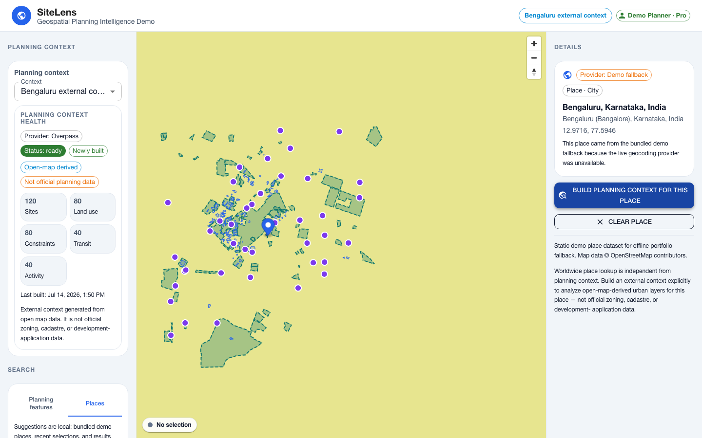
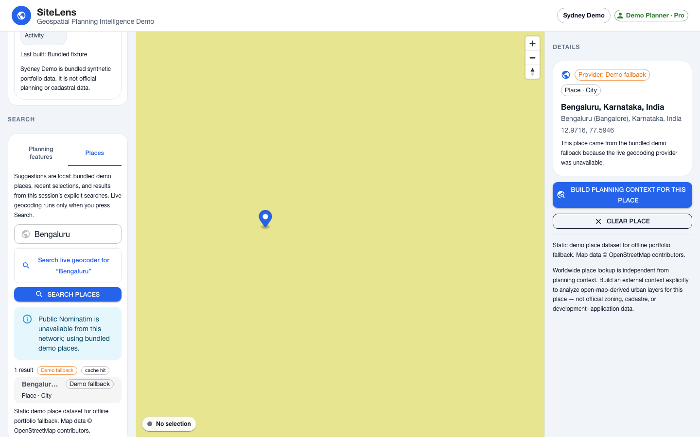
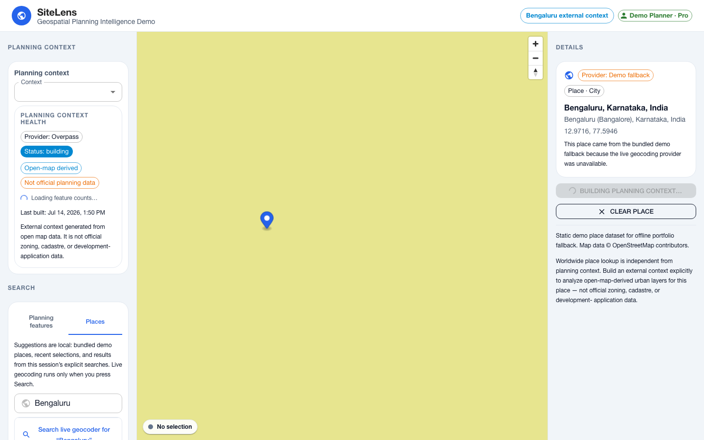
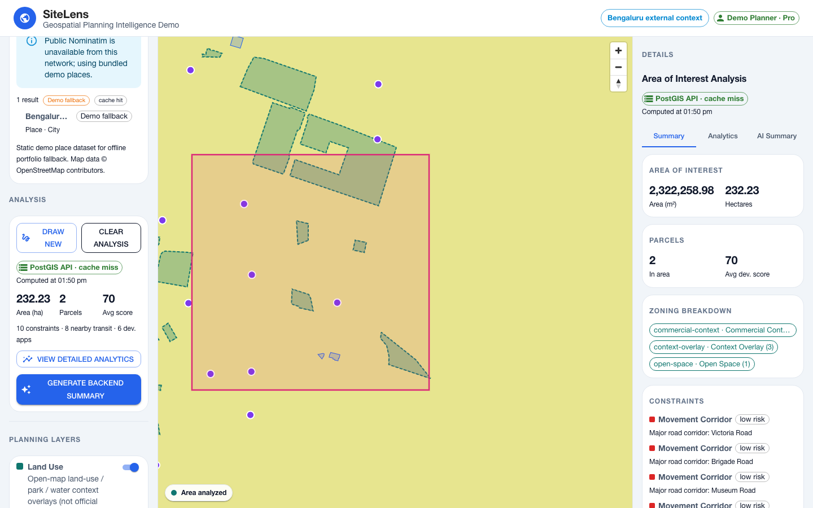
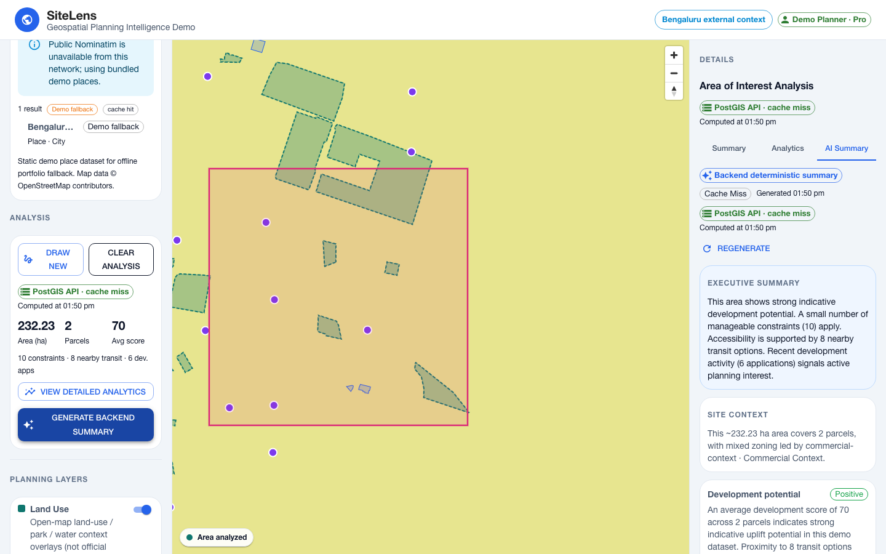

# SiteLens — Geospatial Planning Intelligence Platform

## Reviewer Quickstart

Frontend-only demo (no backend needed):

```bash
npm install
npm run dev:web
```

Full-stack demo (PostGIS + Redis via Docker):

```bash
npm install
npm run db:up
npm run db:migrate
npm run db:seed:billing
npm run ingest:geojson
npm run dev:api
npm run dev:web
```

Quality checks:

```bash
npm run typecheck
npm run lint
npm run test
npm run build
```

Full-stack smoke test (while the API is running):

```bash
npm run smoke:fullstack
# Optional geocoding check (Nominatim or static-demo fallback):
SMOKE_GEOCODING=true SMOKE_GEOCODING_EXPECT_FALLBACK=true npm run smoke:fullstack
# Optional async planning-context build (Overpass may rate-limit):
SMOKE_CONTEXT_BUILD=true npm run smoke:fullstack
```

Docker production-runtime smoke + Playwright demo-flow release gates
(manual / `workflow_dispatch` in CI — not every PR). E2E is deterministic
(`OVERPASS_ENABLED=false`, synthetic context fallback) so it validates the app
flow, not public Overpass:

```bash
npm run smoke:docker:api   # docker build + curl /health (WEB_ORIGIN required)
OVERPASS_ENABLED=false EXTERNAL_CONTEXT_SYNTHETIC_FALLBACK_ENABLED=true \
  npm run test:e2e:smoke
```

Deployed API verification (requires `curl` and `jq`):

```bash
API_BASE=https://<api-host> npm run verify:deployed:api
# Optional async build path on the deployed API:
SMOKE_CONTEXT_BUILD=true API_BASE=https://<api-host> npm run verify:deployed:api
```

See [`docs/environment.md`](docs/environment.md) for env vars,
[`docs/deployment.md`](docs/deployment.md) for frontend-only vs full-stack deploy,
[`docs/deploy-env-checklist.md`](docs/deploy-env-checklist.md) for production/demo
env, [`docs/api-reference.md`](docs/api-reference.md) for endpoints, and
[`docs/case-study.md`](docs/case-study.md) for the employer-facing overview.

## What This Proves

- React + TypeScript geospatial frontend engineering
- MapLibre/Mapbox-style map layer UX
- AOI drawing and spatial analysis workflows
- Fastify backend API design
- PostgreSQL/PostGIS spatial queries and indexes
- GeoJSON ingestion pipeline
- Redis caching and cache-safe entitlement scopes
- Demo auth, roles, plans, and billing gates
- Backend-owned deterministic AI summary service
- Worldwide place search via a cached, rate-limited Nominatim/OSM backend proxy (with labeled static-demo fallback when public Nominatim is unavailable; Places autocomplete is local-only — live geocoding only on explicit Search)
- Dynamic external planning contexts built on demand from open map data (Overpass) for any selected place — async job enqueue + worker, PostGIS cache, scoped search/AOI/summary
- In-process planning-context build worker with job leasing, singleflight, and frontend polling
- CI/CD and deployment-readiness

SiteLens no longer requires hardcoded demo cities for verification. A user can
select a worldwide place, then explicitly **enqueue** a planning-context build.
The API returns a job id immediately; an in-process worker fetches Overpass data
**without** holding a DB pool client, normalizes features, writes them in a short
PostGIS transaction, and marks the job succeeded/failed. The frontend polls
`GET /api/planning-contexts/jobs/:jobId` and shows Health status
(`building` → `ready`) while the build runs. Search, AOI analysis, and planning
summaries then scope to that generated context.

External contexts are not official zoning, cadastre, or development-application
datasets. They are open-map-derived urban context layers intended to demonstrate
the data pipeline, async jobs, spatial normalization, PostGIS analysis, caching,
and AI summary workflow. Sydney Demo remains the bundled synthetic portfolio
fallback.

Public Overpass endpoints may rate-limit or block shared/cloud/VPN networks.
SiteLens treats this as provider availability, not a browser issue. Production
deployments should use a self-hosted or contracted provider and a dedicated
background job queue (the in-process worker is a portfolio demo).

## Overview

SiteLens is a full-stack geospatial planning intelligence platform: toggle
planning layers, search spatial features, inspect metadata, draw an area of
interest, run PostGIS (or local Turf) spatial analysis, view Recharts analytics,
and generate a deterministic AI-assisted planning summary. It also supports
**async external planning-context builds** for worldwide places via a backend
Overpass job pipeline.

It is organized as an **npm-workspaces monorepo** with a React/Vite web app, a
Fastify + TypeScript API, and a shared types package. The API is backed by
**PostgreSQL + PostGIS** and optional **Redis**. When `VITE_API_BASE_URL` is set
the web app talks to the API (with local fallbacks); otherwise it runs
frontend-only against bundled Sydney Demo GeoJSON.

## Monorepo Structure

```txt
sitelens/
  apps/
    web/        # React + Vite dashboard (MapLibre + Zustand + MUI)
    api/        # Fastify + PostGIS API, Redis cache, async build worker
  packages/
    shared/     # @sitelens/shared — shared API/domain types
  docs/         # portfolio + backend docs + screenshots
  package.json  # npm workspaces root
```

- **`apps/web`** (`@sitelens/web`) — dashboard; full-stack mode when
  `VITE_API_BASE_URL` is set, otherwise bundled Sydney Demo GeoJSON.
- **`apps/api`** (`@sitelens/api`) — Fastify API on port `4000`: layers, parcels,
  search, geocoding proxy, analyze-area, planning-summary, planning contexts,
  async build jobs + in-process worker. See [`apps/api/README.md`](apps/api/README.md).
- **`packages/shared`** (`@sitelens/shared`) — shared TypeScript types (API
  envelopes, planning context/job contracts, analysis/summary types).

## Live Demo

- **App:** https://sitelens-demo.vercel.app
- **API:** https://sitelens-api.fly.dev
- **Loom walkthrough (preferred):** _(upload the local capture to Loom and paste the share link here)_

Video walkthrough is Loom-only (no local MP4 embed in the README). Capture with
`npm run capture:demo`, upload to Loom, and paste the share link above.

## Screenshots







Recapture locally (API on `:4000` with worker + Vite on `:5173` pointing at that
API):

```bash
# one-time browser binary for Playwright
npx playwright install chromium

# ffmpeg is required to convert the recorded WebM into MP4 (for Loom upload)
VITE_API_BASE_URL=http://localhost:4000 VITE_DEMO_API_KEY=demo-planner-key \
  npm run dev -w apps/web -- --port 5173 --strictPort
# separate terminal:
CAPTURE_BASE_URL=http://localhost:5173 npm run capture:demo
```

**Screenshots / video policy:** commit PNG screenshots under `docs/screenshots/`.
Ignore `docs/screenshots/_video-tmp/` and `*.webm`. Local `*.mp4` captures are
also gitignored (upload to Loom instead of committing video binaries).

To force a visible `Status: building` shot instead of a fast reuse, age the
existing external context past `EXTERNAL_CONTEXT_REBUILD_AFTER_DAYS` (or delete
it) before running the capture script.

## Why I Built This

My production geospatial and spatial-interface work was done inside private
company products. SiteLens recreates the same engineering patterns in a public,
shareable portfolio project so the approach and code quality can be reviewed
without exposing proprietary work.

## What It Demonstrates

- React + TypeScript frontend architecture
- MapLibre/Mapbox-style map interactions and layer management
- Fastify API design with typed shared contracts
- PostGIS-backed layers, search, and AOI analysis
- Redis caching with entitlement-scoped keys
- Demo auth, roles, plans, and billing gates
- Async Overpass → normalize → PostGIS planning-context build jobs
- Frontend job polling with Health UI (`building` / `ready` / failure rollback)
- Deterministic AI-assisted planning summary with visible source metrics
- Material UI dashboard UX and clean Zustand state management

## Features

- **Interactive map** — MapLibre GL JS, navigation controls, resize-aware status.
- **Planning layers** — parcels/sites, land use, constraints, transit, development
  activity; toggleable with a legend (Sydney Demo or generated context).
- **Planning contexts** — bundled Sydney Demo plus on-demand external OSM
  contexts; Health card shows provider, status, counts, reuse/quality badges.
- **Async context builds** — Places → Build enqueues a job; worker runs Overpass
  off the DB client; UI polls until ready/failed.
- **Search** — planning-feature search scoped to the selected context; Places
  autocomplete is local (live Nominatim only on explicit Search).
- **Feature inspection** — key facts + metadata, zoom/clear, selection highlight.
- **Area of Interest** — click-to-add-points draw mode with draft/complete rendering.
- **Spatial analysis** — PostGIS when API mode is on; Turf.js local fallback.
- **Analytics** — Recharts (zoning/land use, activity, constraints, scores).
- **AI-assisted summary** — backend-owned deterministic narrative with source
  metrics (local fallback on 403 / offline).

## Tech Stack

- [React](https://react.dev/) + [TypeScript](https://www.typescriptlang.org/)
- [Vite](https://vite.dev/) (dev server & build)
- [Material UI](https://mui.com/) (layout, theming, icons)
- [MapLibre GL JS](https://maplibre.org/) (interactive map)
- [Zustand](https://zustand.docs.pmnd.rs/) (state management)
- [Turf.js](https://turfjs.org/) (local spatial analysis fallback)
- [Recharts](https://recharts.org/) (analytics charts)
- [Fastify](https://fastify.dev/) API
- [PostgreSQL + PostGIS](https://postgis.net/) and [Redis](https://redis.io/)
- Overpass / OSM (backend-proxied external planning contexts)

## Architecture

- **View layer:** React function components + Material UI. A three-column
  `AppShell` (sidebar / map / details panel) fills the viewport.
- **Map:** a single MapLibre instance (`SiteMap`) created once; planning sources
  and layers are added after style load, and camera / AOI / highlight are driven
  by store state via effects (UI requests actions such as fly-to; the map reacts).
- **State:** small, focused Zustand stores — `mapStore` (camera, selection,
  fly-to), `layerStore` (visibility), `searchStore` (index + results),
  `analysisStore` (drawing + analysis), `aiSummaryStore` (summary), and `uiStore`
  (active details tab).
- **Domain logic:** pure utilities — `featureIndex` (search index),
  `spatialAnalysis` (Turf calculations), and `mockPlanningSummary` (deterministic
  summary). In **frontend-only** mode (no `VITE_API_BASE_URL`) these run in the
  browser against bundled `/data/*.geojson`. In **full-stack** mode the web app
  calls the API for layers, PostGIS `analyze-area`, cached `planning-summary`,
  geocoding, and async planning-context builds.

## Demo Walkthrough

1. Start on **Sydney Demo** — toggle layers, search, inspect a feature.
2. Switch to **Places**, select **Bengaluru**, click **Build planning context**.
3. Watch the Health card show `building` while the job is `queued`/`running`.
   Optionally click **Cancel watching** — that stops client polling only; the
   backend job continues (use **Resume watching** or refresh contexts later).
4. When `ready`, review feature counts (Open-map derived / Not official).
5. Draw an AOI on the generated context and review PostGIS analysis.
6. Generate the planning summary (external-context caveats).
7. Switch to **Viewer · Free** to show the build/analyze entitlement gate.

A recording checklist and talking points live in [`docs/demo-checklist.md`](docs/demo-checklist.md).

## Local Development

Requires Node.js 20 (see root `engines` / `packageManager`). Install once at the
repo root (npm workspaces):

```bash
npm install        # install all workspaces
npm run dev:web    # web app  → http://localhost:5173
npm run dev:api    # API      → http://localhost:4000
npm run typecheck  # typecheck all workspaces
npm run lint       # lint all workspaces (oxlint)
npm run test       # run workspace tests (Vitest — API + web)
npm run build      # build all workspaces
```

`npm run dev` is a shortcut for `dev:web`. Web and API run independently.

### Backend database (PostgreSQL + PostGIS)

The API is backed by PostGIS via Docker Compose. Full backend setup:

```bash
npm install
npm run db:up          # start PostgreSQL + PostGIS (host port 54329)
npm run db:migrate     # apply SQL migrations
npm run ingest:geojson # load apps/api/data/*.geojson into PostGIS
npm run dev:api        # start the API on :4000
```

Smoke tests:

```bash
curl http://localhost:4000/api/health
curl http://localhost:4000/api/layers
curl http://localhost:4000/api/parcels
curl "http://localhost:4000/api/search?q=central"
```

See [`docs/architecture.md`](docs/architecture.md) and
[`apps/api/README.md`](apps/api/README.md) for schema and details.

### Full-stack analysis mode

`POST /api/analyze-area` runs the AOI spatial analysis in **PostGIS**. The
frontend uses it when `VITE_API_BASE_URL` is set, and falls back to local
Turf.js if the API is unreachable — the UI shows which engine was used
(`PostGIS API` / `Local Turf` / `Turf fallback`).

### Frontend-only vs full-stack

| Mode | Needs | Web env |
|------|--------|---------|
| **Frontend-only** | `npm run dev:web` (or static host) | omit `VITE_*` |
| **Full-stack** | API + PostGIS + Redis + seed/ingest | `VITE_API_BASE_URL` + optional `VITE_DEMO_API_KEY` |

Enable full-stack mode for the web app (required for PostGIS analysis, Places
search, Redis cache chips, and demo entitlements against a real API):

```bash
# apps/web/.env.local  (or Vercel project env for a deployed full-stack demo)
VITE_API_BASE_URL=http://localhost:4000
VITE_DEMO_API_KEY=demo-planner-key
```

A deployed frontend **without** `VITE_API_BASE_URL` stays frontend-only even if
an API exists. See [`docs/deployment.md`](docs/deployment.md).

Run everything, then draw an area of interest in the browser:

```bash
npm run db:up && npm run db:migrate && npm run ingest:geojson && npm run db:seed:billing
npm run dev:api
npm run dev:web
```

Analyze-area smoke test (run twice — first `cache: "miss"`, second `cache: "hit"`):

```bash
curl -X POST http://localhost:4000/api/analyze-area \
  -H "content-type: application/json" \
  -d '{"geometry":{"type":"Polygon","coordinates":[[[151.205,-33.87],[151.215,-33.87],[151.215,-33.86],[151.205,-33.86],[151.205,-33.87]]]}}'
```

### Caching (Redis)

`npm run db:up` also starts Redis (port `6389`). The API caches layers, parcels,
search, and AOI analysis, and reports the outcome in `meta.cache`
(`hit` / `miss` / `disabled` / `error`); the frontend shows it subtly
(e.g. `PostGIS API · cache hit`). Caching is optional and degrades gracefully —
if Redis is down the API still returns DB results (`cache: "error"`) and the app
keeps working. Ingestion clears the planning cache; `npm run cache:clear` clears
all keys.

### Demo auth & entitlements

The API supports **API-key demo auth** with roles (`viewer`, `planner`, `admin`)
and plans (`free`, `pro`, `enterprise`). Capabilities are derived from role/plan
and gate the API:

- Public: `GET /api/health`, `GET /api/layers`.
- Entitlement-limited: `GET /api/search` (5 results for free/anonymous, 8 for
  pro/enterprise) and `GET /api/parcels` (first 5 for free, full for pro+).
- Gated (`403` otherwise): `POST /api/analyze-area` and `POST /api/planning-summary`
  require a `planner`/`enterprise` account. Ingestion is `admin`-only.

`GET /api/me` returns the current user + capabilities. Cached responses are
scoped by entitlement (`…:free:` vs `…:pro:`) so lower tiers never receive
higher-tier data.

Run the web app in different demo roles (or use the **Demo access** switcher in
the sidebar footer at runtime):

```bash
VITE_DEMO_API_KEY=demo-planner-key npm run dev:web   # Planner · Pro
VITE_DEMO_API_KEY=demo-viewer-key  npm run dev:web   # Viewer · Free
VITE_DEMO_API_KEY=demo-admin-key   npm run dev:web   # Admin · Enterprise
```

If a viewer/free user runs analysis, the backend returns `403` and the frontend
falls back to local Turf.js with a clear entitlement warning.

> **Not production auth.** This is a portfolio demo. Production would use
> OAuth/SSO, JWT/session cookies, Passport-style strategies, and org/team
> membership.

### Stripe-style billing & plans

Capabilities are driven by a **billing plan catalog** — **Free** (limited
search/parcels), **Pro** (PostGIS analysis + AI summaries), **Enterprise**
(ingestion/admin) — persisted in DB (`demo_accounts`, `subscriptions`,
`usage_counters`). `GET /api/billing/plans` and `GET /api/billing/current`
expose it; `POST /api/billing/demo-plan` switches the demo plan; and a
Stripe-compatible `POST /api/billing/webhook` maps subscription events (safe
without real Stripe secrets). Successful backend analyses are metered.

The sidebar footer has a **Demo access** control to switch identity (role) and
plan at runtime; downgrading a planner to Free blocks backend analysis (`403`)
and the app falls back to local Turf with a plan-gated warning. Seed billing
with `npm run db:seed:billing`.

> Demo billing only — no live checkout. Production path: Stripe Checkout +
> Customer Portal, webhook signature verification via the Stripe SDK, and
> org/team billing.

### Current boundaries

- **Map layer rendering** still reads static GeoJSON from `public/data`. With
  `VITE_API_BASE_URL` set, analysis, planning search, Places geocode, billing,
  and planning summary call the API.
- `planning-summary` is a **backend-owned deterministic** summary (no LLM).
- Places search proxies Nominatim and may return labeled **static-demo**
  fallback when the public provider blocks the host — never a browser-side
  Nominatim call. Places autocomplete is local (demo places, recent
  selections, and this session’s explicit search results); live geocoding runs
  only on Search / “Search live geocoder,” not on every keystroke.
- Public Overpass may rate-limit or block shared/cloud/VPN networks during
  external context builds — SiteLens surfaces this as provider availability.
  Production should use a self-hosted/contracted Overpass (or equivalent) plus
  a background job queue rather than holding a DB session across the fetch.
- If the database is unavailable, DB-backed routes return `503`; AOI analysis
  falls back to Turf with a warning. Redis degrades gracefully when down.
- Demo auth/billing keys are portfolio-only. Real Stripe Checkout/Portal and
  production auth remain future work.
- No paid map token is required (public MapLibre demotiles style).

## Project Structure

```txt
apps/
  web/                   # @sitelens/web — React + Vite dashboard
    public/data/         # mock planning GeoJSON (parcels, zoning, etc.)
    public/favicon.svg
    src/
      app/               # App root (theme + shell)
      components/        # layout, map, analysis, charts
      data/              # layer config + display helpers
      store/             # Zustand stores (map, layer, search, analysis, aiSummary, ui)
      utils/             # featureIndex, spatialAnalysis, mockPlanningSummary
      types/             # frontend TypeScript types
      theme/             # Material UI theme
  api/                   # @sitelens/api — Fastify + TypeScript API (PostGIS)
    data/                # source GeoJSON ingested into PostGIS
    db/
      migrations/        # 001 enable postgis, 002 tables, 003 indexes
      seeds/             # seed docs
    src/
      app.ts             # Fastify app factory (testable)
      server.ts          # startup (port 4000)
      config.ts          # env config (DATABASE_URL, DB_SSL) + API version
      plugins/           # requestLogger, errorHandler
      routes/            # health, layers, parcels, search, analysis, planningSummary
      lib/               # layerConfig, featureText, httpErrors
      db/                # pool, sql, migrate, reset, ingestGeojson, seed, spatialRepository
      test/              # Vitest API tests
packages/
  shared/                # @sitelens/shared — shared types (api, planning, analysis)
docs/
  demo-checklist.md      # recording walkthrough + talking points
  application-snippets.md# paste-ready job-application text
  deployment.md          # frontend-only vs full-stack deploy order
  deploy-env-checklist.md # production/demo API + web env vars
  frontend-deploy-verification.md # post-deploy UI checklist
  portfolio-blurb.md     # short portfolio description
  screenshots/           # README screenshot assets
```

## Data Model / Mock Data

All data is small, hand-authored **mock** GeoJSON under `public/data`, clustered
around the Sydney CBD — **not** real cadastral or planning data:

- `parcels.geojson` — polygons with `parcelId`, `zoning`, `currentUse`,
  `developmentScore`, `areaSqm`, `status`.
- `zoning.geojson` — polygons with `zoneCode`, `zoneName`, `description`.
- `constraints.geojson` — polygons with `constraintType`, `riskLevel`,
  `description`.
- `transit.geojson` — points with `name`, `mode`, `distanceCategory`.
- `development-activity.geojson` — points with `projectName`, `status`,
  `applicationType`, `lodgedMonth`.

Spatial analysis and charts are derived from this mock data, not official records.

## AI Summary Design

The planning summary is a **deterministic** generator with **no LLM**. It is now
**backend-owned**: the frontend POSTs the spatial-analysis metrics to
`/api/planning-summary`, which enforces the `summary:generate` entitlement,
meters usage, caches in Redis (plan-scoped), and returns source-transparent
planning text with severity-tagged sections and recommended next checks. The
frontend keeps an identical **local fallback** (`generateMockPlanningSummary`)
for `403` / API failure / no-API, and the panel shows the summary engine, cache
status, and the **exact source metrics** used. **Production path:** swap the
deterministic generator for an LLM call while keeping source metrics + caveats,
add evals + prompt/version logging, and human review for high-risk outputs.

## Limitations

- External contexts are open-map-derived urban context — **not** official zoning,
  cadastre, or development-application datasets.
- Bundled Sydney Demo is synthetic portfolio data.
- Spatial analysis uses intersection / proximity heuristics, not regulatory rules.
- The planning summary is deterministic template logic (backend-owned with a
  local fallback), not a real language model.
- Demo API-key auth and plan switching are portfolio-only (not production auth).
- The async build worker is in-process (demo queue); production should use a
  dedicated worker/queue and a contracted Overpass (or equivalent).
- Public Overpass/Nominatim may rate-limit shared/cloud/VPN networks.
- Basemap is the public MapLibre demo style (no paid token).

## Future Improvements

- Real basemap / vector tiles (`ST_AsMVT`) per planning context.
- Dedicated job queue + queue health observability.
- Context-scoped Redis invalidation and rate limits on expensive routes.
- Saved AOI reports and context comparison views.
- Optional real LLM integration behind the same source-metric transparency UX.
